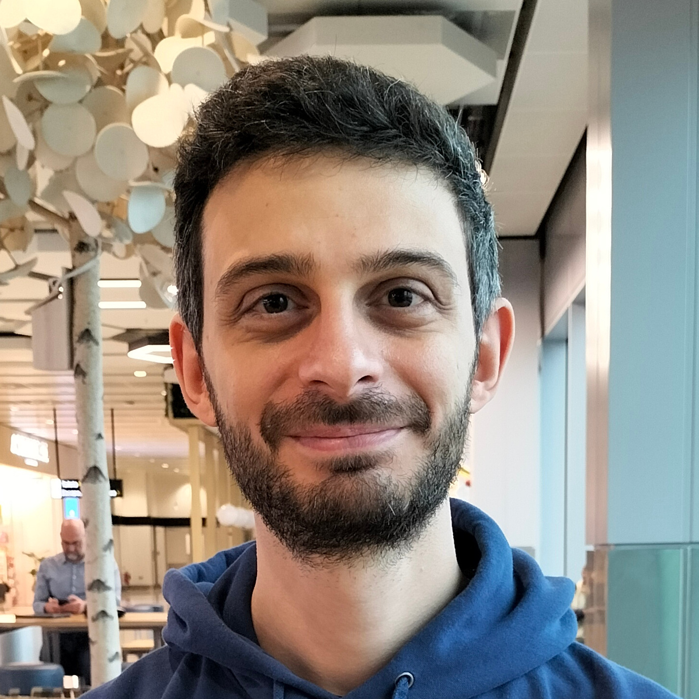

## About Me

I am young researcher interested in the physics of complex and disordered systems of biological relevance from a theoretical and computational point of view.

For a complete Academic Curriculum Vitae, download the full [CV](./Iorio_CV.pdf)

## Competencies and interests

* Statistical and Computational Physics (soft matter).
* Molecular Dynamics (all atoms/coarse grain) and Lattice Boltzmann method.
* Hydrodynamic interactions.
* Enhanced sampling methods.
* Monte Carlo methods.
* High Performance Computing and coding.
